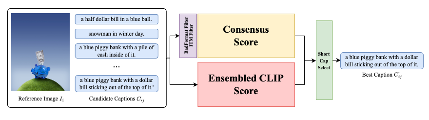

# NICE2024

Official repository of Team DSBA for the NICE 2024 Challenge


**Table of Contents**
- [Setup](#setup)
  - [Environment](#environment)
  - [Data](#data)
  - [Model Weight](#model-weight)
- [How to run](#run)
  - [1. CLIP Score BLIP-ITC,ITM Score Generation](#1-clip-score-blip-itcitm-score-generation)
  - [2. Consensus Score Generation](#2-consensus-score-generation)
  - [3. Ensemble Score and Submission File Generation](#3-ensemble-score-and-submission-file-generation)
- [Reference](#reference)
## Setup
### Environment
This guide provides detailed instructions for setting up the necessary environments to run the code for different models including `BLIP2,` `EvaCLIP`, `MobileCLIP`, `MetaCLIP`, and `OpenCLIP`. Each model requires a unique environment for optimal performance and compatibility.

You can install the required dependencies by running the following commands:

```bash
# BLIP2
conda create -n blip2 python=3.8
conda activate blip2
pip install salesforce-lavis omegaconf
```
```bash
# EVA-CLIP
conda create -n evaclip python=3.10
conda activate evaclip
git clone https://github.com/baaivision/EVA.git
cd EVA/EVA-CLIP-18B
pip install torch==1.12.1+cu116 torchvision==0.13.1+cu116 --extra-index-url https://download.pytorch.org/whl/cu116
pip install -r requirements.txt
pip install omegaconf
```
```bash
# CLIP Env (MobileCLIP, MetaCLIP, OpenCLIP)
conda create -n clipenv python=3.10
conda activate clipenv
# Install Mobile CLIP
git clone https://github.com/apple/ml-mobileclip.git
cd ml-mobileclip
pip install -e .
pip install omegaconf
```
or you can install environment from dockerfile by running the following command:
```bash
docker build -t nice2024 .
docker run -it --gpus all nice2024
```

### Data
The `original data` can be downloaded from the [competition website](https://codalab.lisn.upsaclay.fr/competitions/16930#participate) or you can make use of the `get_data.sh` script to download the data.
The `scores` can be downloaded from the following links: [Google Drive](https://drive.google.com/drive/folders/1-p2ps4DWpexhSQj4IP6pMPMgcS4KthM-?usp=sharing)

  
  ```bash
  ├── data
│   ├── original_data
│   │   ├── candidate_captions.csv
│   │   ├── images_20k
│   │   └── pred.csv
│   ├── results
│   │   └── #Result csv file will be saved here
│   └── scores
│       ├── blip_itc_scores.json # You can generate by 1. Score Generation
│       ├── blip_itm_scores.json # You can generate by 1. Score Generation
│       ├── evaclip_scores.json # You can generate by 1. Score Generation
│       ├── itm_filtered_consensus.json # You can generate by 2. Consensus Score Generation
│       ├── metaclip_scores.json # You can generate by 1. Score Generation
│       ├── mobileclip_scores.json # You can generate by 1. Score Generation
│       └── openclip_scores.json # You can generate by 1. Score Generation
  ```

### Model Weight
The model weights can be downloaded from the following links:
Weights of openclip and blip2 is automatically downloaded when you run the score generation script.

<div align="center">

|    `model_name`     | `model weight` |
|:-------------------:|:--------------:|
| [EvaCLIP](https://github.com/baaivision/EVA/tree/master/EVA-CLIP-18B) | [EVA_18B_psz14.fp16](https://huggingface.co/BAAI/EVA-CLIP-18B/resolve/main/EVA_CLIP_18B_psz14_s6B.fp16.pt) (`36.7GB`) |
| [MetaCLIP](https://github.com/facebookresearch/MetaCLIP)  | [ViT-bigG-14-quickgelu](https://dl.fbaipublicfiles.com/MMPT/metaclip/G14_fullcc2.5b.pt) (`28.38GB`) |
| [MobileCLIP](https://github.com/apple/ml-mobileclip/tree/main) | [mobileclip_blt](https://docs-assets.developer.apple.com/ml-research/datasets/mobileclip/mobileclip_blt.pt) (`571.46MB`) |

</div>

or you can download all the model weights by running the following command:
```bash
source ./scripts/00_get_model_weights.sh   # Files will be downloaded to `model_weights` directory.
```
  ```bash
├── model_weights
│   ├── evaclip
│   │   └── EVA_CLIP_18B_psz14_s6B.fp16.pt
│   ├── metaclip
│   │   └── G14_fullcc2.5b.pt
│   └── mobileclip
│       └── mobileclip_blt.pt
  ```

## How to run
### 1. CLIP Score BLIP-ITC,ITM Score Generation
You need to prepare score files for each vision-language model to generate the final submission file. 
You can either generate the scores for each model or you can download the scores from the following links: [Google Drive](https://drive.google.com/drive/folders/1-p2ps4DWpexhSQj4IP6pMPMgcS4KthM-?usp=sharing) \
You need a 80GB of VRAM for running the EVA-CLIP 18B Model.

```bash
source ./scripts/01_evaclip_score.sh #script_filename [evaclip_score.sh, metaclip_score.sh, mobileclip_score.sh, openclip_score.sh, blip_itc_score.sh, blip_itm_score.sh]
```
or you can download all the scores by running the following command:
```bash
source ./scripts/01_all_score.sh
```
### 2. Consensus Score Generation
After finishing generating scores for each vision language models. Now you can generate consensus scores by running the following command:
```bash
source ./scripts/02_consensus_score.sh
```
### 3. Ensemble Score and Submission File Generation
At last, fuse all the scores and generate the final submission file by running the following command:
```bash
source ./scripts/03_ensemble_score.sh
```
#### Notice on Precision Variability
Please be aware that when running inference on different GPUs, minor discrepancies in the results may occur, particularly at or beyond the fourth decimal place. These variations stem from differences in floating-point arithmetic precision and hardware architecture. For consistent results, please refer to the provided score JSON files.


## Results
The final submission file will be saved in the `data/results` directory. 
The submission file will be named as `pred.csv` and will be in the following format:

<div align="center">

|    id     | filename | caption |
|:---------:|:--------:|:-------:|
| 0        | 1586682407.jpg | a man and a woman in lab coats looking at a watch.  |
| 1        | 1866091313.jpg |a man standing in a field of wheat.                  |
| 2        | 1722076415.jpg |a group of people riding a ski lift on a sunny day.  |
| ...      | ...            | ...                                                 |

</div>

Also you can find the final scores of each caption in `data/results` directory. 
The final scores will be named as `pred.json` and will be in the following format:

```json
{"1839580541.jpg": 
  {"captions": ["a woman is holding a small blue brush and sitting on a bed.", 
                "a woman sitting on a bed with a blue paintbrush.", 
                "a woman holding a roller brush sitting on top of a bed.",
                ...
                ],
   "scores": [3.537973796768244, 
              5.110968624476615, 
              3.5150481446519826,
              ...
              ]
  },
  ...
}
    
```

## Reference
### BLIP2
```bibtex
@inproceedings{li2023blip,
  title={Blip-2: Bootstrapping language-image pre-training with frozen image encoders and large language models},
  author={Li, Junnan and Li, Dongxu and Savarese, Silvio and Hoi, Steven},
  booktitle={International conference on machine learning},
  pages={19730--19742},
  year={2023},
  organization={PMLR}
}
```
### EvaCLIP
```bibtex
@article{EVA-CLIP-18B,
  title={EVA-CLIP-18B: Scaling CLIP to 18 Billion Parameters}, 
  author={Quan Sun and Jinsheng Wang and Qiying Yu and Yufeng Cui and Fan Zhang and Xiaosong Zhang and Xinlong Wang},
  journal={arXiv preprint arXiv:2402.04252},
  year={2023}
}
```
### MetaCLIP
```bibtex
@inproceedings{xu2023metaclip,
   title={Demystifying CLIP Data},
   author={Hu Xu, Saining Xie, Xiaoqing Ellen Tan, Po-Yao Huang, Russell Howes, Vasu Sharma, Shang-Wen Li, Gargi Ghosh, Luke Zettlemoyer and Christoph Feichtenhofer},
   journal={arXiv preprint arXiv:2309.16671},
   year={2023}
}
```
### MobileCLIP
```bibtex
@InProceedings{mobileclip2024,
  author = {Pavan Kumar Anasosalu Vasu, Hadi Pouransari, Fartash Faghri, Raviteja Vemulapalli, Oncel Tuzel},
  title = {MobileCLIP: Fast Image-Text Models through Multi-Modal Reinforced Training},
  booktitle = {Proceedings of the IEEE/CVF Conference on Computer Vision and Pattern Recognition (CVPR)},
  month = {June},
  year = {2024},
}
```
### OpenCLIP
```bibtex
@software{ilharco_gabriel_2021_5143773,
  author       = {Ilharco, Gabriel and
                  Wortsman, Mitchell and
                  Wightman, Ross and
                  Gordon, Cade and
                  Carlini, Nicholas and
                  Taori, Rohan and
                  Dave, Achal and
                  Shankar, Vaishaal and
                  Namkoong, Hongseok and
                  Miller, John and
                  Hajishirzi, Hannaneh and
                  Farhadi, Ali and
                  Schmidt, Ludwig},
  title        = {OpenCLIP},
  month        = jul,
  year         = 2021,
  note         = {If you use this software, please cite it as below.},
  publisher    = {Zenodo},
  version      = {0.1},
  doi          = {10.5281/zenodo.5143773},
  url          = {https://doi.org/10.5281/zenodo.5143773}
}
```

## Acknowledgements
Our codebase is built using multiple opensource contributions. We would like to thank the authors of the following repositories for their valuable contributions